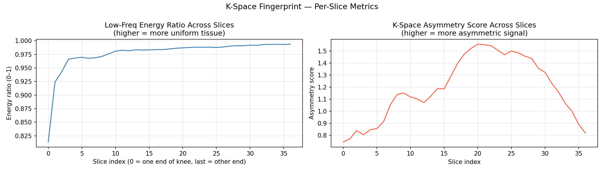
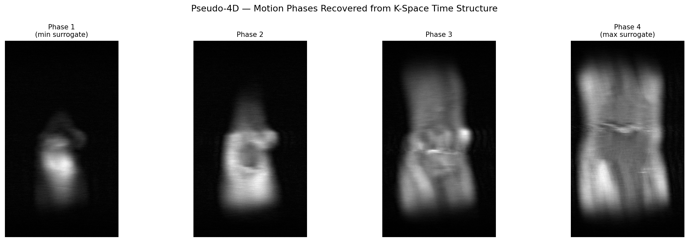

# Kode — K-Space Decode

> What if k-space itself is the answer — and image reconstruction is just one of many things you can do with it?

Kode is a Python toolkit for exploring raw MRI k-space data beyond standard image reconstruction. Instead of treating k-space as a stepping stone to a DICOM image, Kode treats it as a rich signal in its own right — one that contains diagnostic, structural, and motion information before a single pixel is rendered.

Built on the [fastMRI dataset](https://fastmri.med.nyu.edu/) from Meta AI / NYU Langone.

---

## Output Examples

**Progressive Reveal — watching a knee MRI assemble itself from frequency data**


**Selective Frequency Reconstruction — isolating tissue layers without segmentation**


**K-Space Fingerprint — radial power profile and per-slice metrics**



**Pseudo-4D Motion Phases — motion states recovered from a static scan**



---

## Features

| Module | What it does |
|---|---|
| `selective_reconstruct` | Filter specific frequency bands before IFFT — separate tissue types without segmentation |
| `fingerprint` | Analyze k-space shape as a diagnostic signal — no reconstruction required |
| `progressive_reveal` | Reconstruct from low to high frequency in steps — visualize how detail builds |
| `pseudo4d` | Recover motion surrogates from k-space time structure in standard 3D acquisitions |

---

## Why K-Space

Standard MRI pipelines discard frequency-domain information the moment reconstruction runs. Kode works upstream of that step — treating k-space as a source of signal intelligence rather than just a reconstruction input.

```
MRI Scanner
    → K-Space (raw frequency data)          ← Kode works here
        → IFFT → Reconstructed Image        ← everything else works here
```

---

## Dataset

Kode uses the [fastMRI dataset](https://fastmri.med.nyu.edu/) — a large-scale open MRI dataset released by Meta AI Research and NYU Langone Health. Raw k-space files are provided in HDF5 format (`.h5`).

To get the dataset: request access at [fastmri.med.nyu.edu](https://fastmri.med.nyu.edu/). Brain and knee k-space data are available.

---

## Setup

```bash
git clone https://github.com/nadiapriyam/kode.git
cd kode
pip install -r requirements.txt
```

---

## Project Structure

```
kode/
├── kode/
│   ├── __init__.py
│   ├── io.py                  # Load .h5 k-space files
│   ├── selective_reconstruct.py
│   ├── fingerprint.py
│   ├── progressive_reveal.py
│   └── pseudo4d.py
├── notebooks/
│   ├── 01_selective_reconstruct.ipynb
│   ├── 02_fingerprint.ipynb
│   ├── 03_progressive_reveal.ipynb
│   └── 04_pseudo4d.ipynb
├── data/                      # Place fastMRI .h5 files here (gitignored)
├── requirements.txt
└── README.md
```

---

## Status

Active development. Built as part of the Meridian medical imaging platform research.
