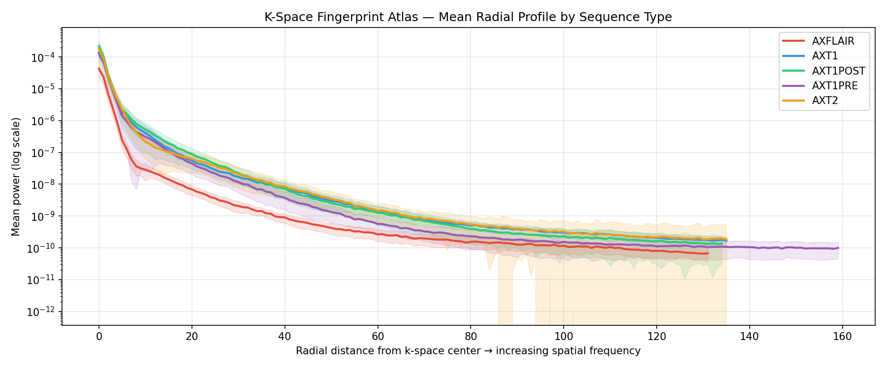
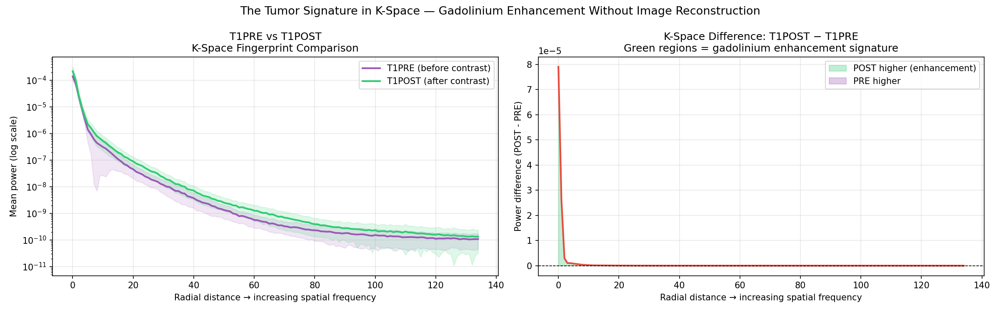
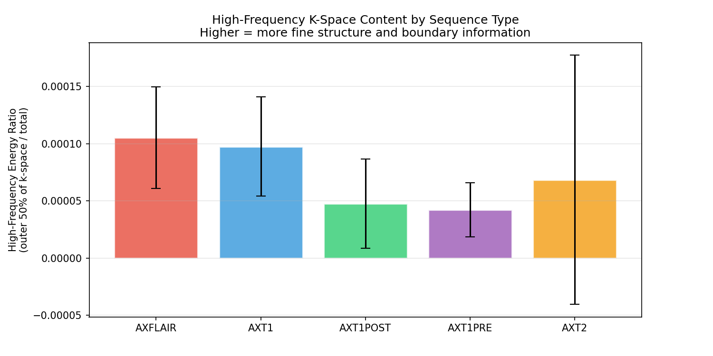
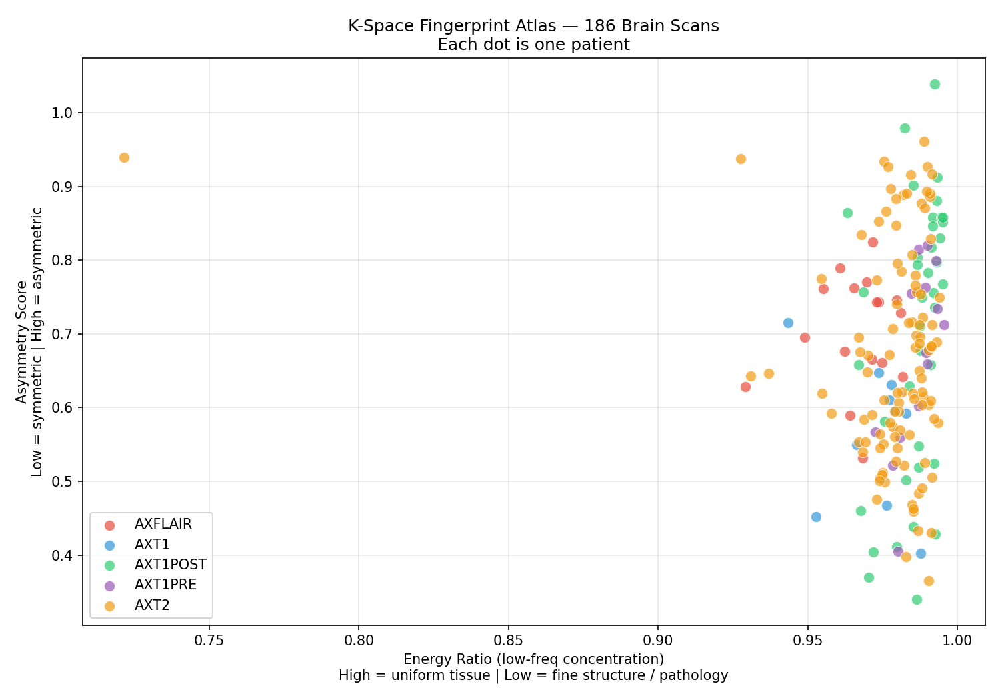
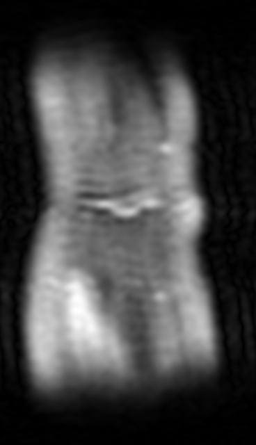
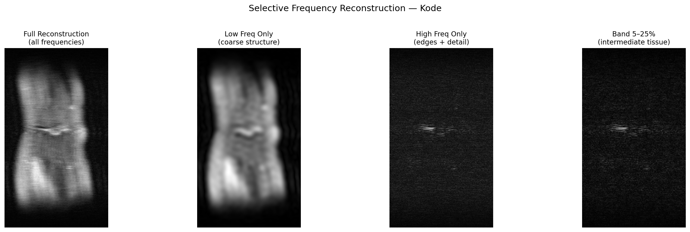
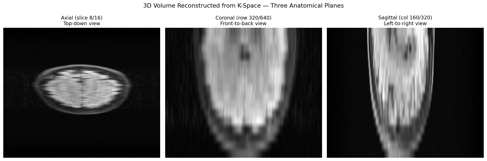

# Kode — K-Space Decode

### The physics of spatial frequency encoding does the work — not an algorithm guessing from grayscale values.

---

## The Problem

Every radiologist and every AI diagnostic model works on the same thing: a **reconstructed grayscale image**. But that image is a mathematical derivative — it's what you get *after* the raw signal has been transformed and compressed. By the time a pixel exists, information has already been lost.

The raw signal is called **k-space**. It is what the MRI scanner actually measures.

### Why K-Space Is Fundamentally Different

In image space, a pixel tells you the local intensity at one point. A tumor affects only the pixels it occupies.

In k-space, **every single point encodes a global property of the entire image**. A tumor — no matter how small — changes the frequency distribution across the entire k-space grid. Its cellular density, its boundary sharpness, and its internal structure all leave measurable signatures in the raw signal — before reconstruction, before any information is lost.

```
Image space:  tumor occupies ~1% of pixels   →  model sees a local patch
K-space:      tumor changes 100% of k-space  →  signal is global, always present
```

**The bigger idea: instead of using AI to read images, use AI to read k-space directly.**

---

## Notebook 5 — Brain Fingerprint Atlas: 186 Scans, 5 Sequence Types

The central experiment. Can k-space fingerprints distinguish scan types, detect gadolinium enhancement, and flag outliers — without ever reconstructing an image?

### Finding 1 — Sequence Types Have Distinct K-Space Signatures

Each line is the mean radial power profile across all patients of that sequence type. The shaded band is patient-to-patient variation.

FLAIR's fluid suppression is visible as a measurably lower power curve across mid-to-high frequencies. The physics of the acquisition leave a direct signature in k-space — detectable before any image is constructed.



> FLAIR (red) sits measurably lower than every other sequence across the mid-to-high frequency range. FLAIR uses an inversion pulse to null CSF signal — that suppression removes energy from the entire acquisition and shows up as a lower power curve. No image was constructed to see this. The physics left a fingerprint in the raw frequency data. The shaded bands confirm the separation exceeds patient-to-patient variance — it is real and consistent.

---

### Finding 2 — The Tumor Signature: T1PRE vs T1POST

T1PRE and T1POST are the same scan type — acquired before and after gadolinium contrast injection. The only thing that changes between them is that gadolinium accumulates in tumor tissue where the blood-brain barrier is disrupted, making those regions brighter on T1POST.

**Their k-space difference is a direct frequency-domain measurement of tumor tissue** — no image, no segmentation, no radiologist required.

The right panel shows the difference curve (T1POST − T1PRE). Green regions are frequency bands where post-contrast signal is higher than pre-contrast — the gadolinium enhancement signature encoded in raw k-space.



> The left panel overlays T1PRE and T1POST fingerprint curves — same sequence, same anatomy, different only in gadolinium contrast. The right panel shows the difference (T1POST − T1PRE). Green regions are frequency bands where post-contrast signal exceeds pre-contrast — the k-space signature of gadolinium accumulating in tumor tissue where the blood-brain barrier is disrupted. Tumor tissue changes the raw frequency distribution of k-space, measurably, before any image is constructed.

---

### Finding 3 — Tumor Boundaries Live in High-Frequency K-Space

Boundaries are sharp transitions. Sharp transitions are encoded in high-frequency k-space. If tumor margins are more precisely encoded in k-space than in image space, T1POST should show systematically different high-frequency energy than T1PRE.

This chart measures exactly that — the fraction of total k-space energy in the outer 50% of frequency space, by sequence type.



> Each bar is the average fraction of total k-space energy in the outer 50% of frequency space — where boundaries and fine structure are encoded. If tumor margins are more precisely defined in k-space than image space, T1POST should show different high-frequency energy than T1PRE. The error bars show patient variance within each group. A consistent difference between T1PRE and T1POST — even small — means boundary information is detectable in raw k-space at the population level.

---

### Finding 4 — Outlier Detection Without an Image

Each dot is one patient. Scans that deviate more than 2 standard deviations from their sequence-type cluster are flagged automatically — candidates for radiologist review, identified from raw k-space before any image is constructed.



> Each dot is one patient. Most cluster tightly between 0.95–1.0 on the x-axis — expected for brain scans dominated by low-frequency content. Outliers on the far left have signal spread more broadly across frequencies than their peers. These patients were flagged with no image, no AI model, and no training data — just two scalar numbers extracted from raw k-space. The next step: load those specific scans, reconstruct the image, and ask a radiologist whether the k-space anomaly corresponds to a real finding.

---

## Why This Matters Clinically

Current tumor margin delineation in radiation therapy adds **1-2cm margins** around visible tumor boundaries to compensate for image-space uncertainty. That margin irradiates healthy tissue.

If tumor margins can be characterized more precisely in k-space — where boundary information is encoded in the phase and amplitude of high-frequency components before reconstruction blurs it — those margins shrink. Smaller margins mean less healthy tissue irradiated per treatment fraction.

The same principle applies to surgical planning, treatment response monitoring, and early detection.

---

## All Notebooks

| Notebook | What it demonstrates |
|---|---|
| [`05_brain_fingerprint_atlas`](notebooks/05_brain_fingerprint_atlas.ipynb) | 186-scan atlas, gadolinium tumor signature, high-freq boundary analysis, outlier detection |
| [`06_kspace_to_3d_cornerstone`](notebooks/06_kspace_to_3d_cornerstone.ipynb) | Full 3D volume from k-space → NIfTI export → Cornerstone3D browser rendering |
| [`07_synthetic_validation`](notebooks/07_synthetic_validation.ipynb) | Synthetic lesion injection with known ground truth → detection threshold analysis, no radiologist required |
| [`01_selective_reconstruct`](notebooks/01_selective_reconstruct.ipynb) | Tissue separation by frequency band — no segmentation algorithm |
| [`02_fingerprint`](notebooks/02_fingerprint.ipynb) | Radial power profile and asymmetry metrics |
| [`03_progressive_reveal`](notebooks/03_progressive_reveal.ipynb) | MRI assembling from DC component to full resolution |
| [`04_pseudo4d`](notebooks/04_pseudo4d.ipynb) | Motion phase recovery from k-space time structure |

---

**Progressive Reveal — MRI assembling from raw frequency data**



**Selective Frequency Reconstruction — tissue layers without segmentation**



**3D Volume Reconstructed from K-Space — three anatomical planes**



---

## Setup

```bash
git clone https://github.com/nadiapriyam/kode.git
cd kode
pip install -r requirements.txt
```

Data: request access at [fastmri.med.nyu.edu](https://fastmri.med.nyu.edu/). Place `.h5` files in `data/`.

---

## Related

[Meridian](https://github.com/nadiapriyam/meridian) — HIPAA-aware mobile annotation platform. Cornerstone3D volumes reconstructed by Kode feed directly into Meridian's patient-facing viewer.
